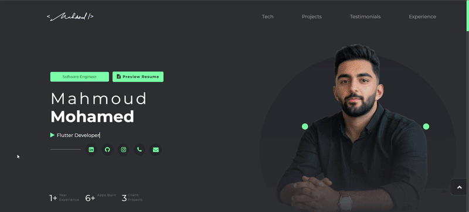

<!-- Badges at Top -->

  
  
  
  

<!-- Typing Logo (brand green = #6EF3A5) -->

<!-- Links Section -->

  
  

---

## 🖼️ Preview

---

## 🚀 Key Features

<b>🧠 Animated Hero</b>

 

- **Typewriter Effect**: Role title types itself with a blinking caret.
- **Live Stats**: Years of experience, apps built and client projects counter.
- **Social Handles**: Linkedin, GitHub and Instagram icons with hover glow.

<b>🛠️ Tech Stack Section</b>

 

- **Categorized Grid**: Mobile, databases, networking, state management, storage, testing and CI/CD.
- **Local SVG Icons**: Brand-colored icons (green filter) with hover states.
- **Illustration**: Side SVG artwork that adapts across breakpoints.

<b>🗂️ Projects Showcase</b>

 

- **Project Cards**: Featured work with live images and gradient fallback on error.
- **Smart Labels**: App Store, Google Play, Web App, Demo, GitHub and Client Review badges.
- **External Links**: Every project opens its store page, demo or repository.

<b>💼 Experience Timeline</b>

 

- **Visual Timeline**: Glowing green dots on a vertical line.
- **Tech Pills**: Per-job technologies as tags.
- **Detail Bullets**: Role highlights with clean typography.

<b>📬 Contact & Current Date</b>

 

- **Live Date Card**: Month, day and weekday rendered from the real clock.
- **Copy-to-Clipboard**: Email card copies instantly with "Copied!" feedback.
- **Resume Preview**: One-click button opens the latest CV.

<b>📱 Responsive & Adaptive</b>

 

- **Breakpoint System**: Dedicated stylesheets for mobile (xs/s) and desktop (ml/l/xl/4K).
- **Touch-Friendly**: Mobile-first spacing, safe-area insets and 44px touch targets.
- **Desktop Untouched**: ≥769px renders pixel-identical to the original design.

---

## 🛠️ Tech Stack

- **Markup / Style**: `HTML5`, `CSS3` (custom properties & media queries)
- **Language**: `JavaScript (ES6+)` — no frameworks, modular renderers
- **Libraries**: `jQuery 3`, `Bootstrap 4`, `AOS` (Animate On Scroll)
- **Icons / Fonts**: `Font Awesome 4.7`, `Montserrat` (Google Fonts), `Agustina` (brand font)
- **SEO / PWA**: Open Graph tags, JSON-LD structured data, `manifest.json`, GA4 analytics

---

## 📅 Roadmap

- [x] Animated hero with typewriter & live stats
- [x] Tech stack section with SVG icons
- [x] Projects showcase with smart labels
- [x] Experience timeline with tech pills
- [x] Contact section with current date & resume preview
- [x] SEO meta, Open Graph & GA4 analytics
- [ ] Tablet responsiveness polish (481–768px)
- [ ] Dark / light theme toggle
- [ ] PWA service worker & offline support

---

Made with ❤️ by Korya
 
<b>© 2026 Mahmoud Portfolio</b>
 
 
<i>Design inspired by
<a href="https://mhmz.dev/">Muhammad Hamza's portfolio</a>
<a href="https://github.com/mhmzdev">(GitHub)</a> — all credit for the original work goes to him 💚</i>

